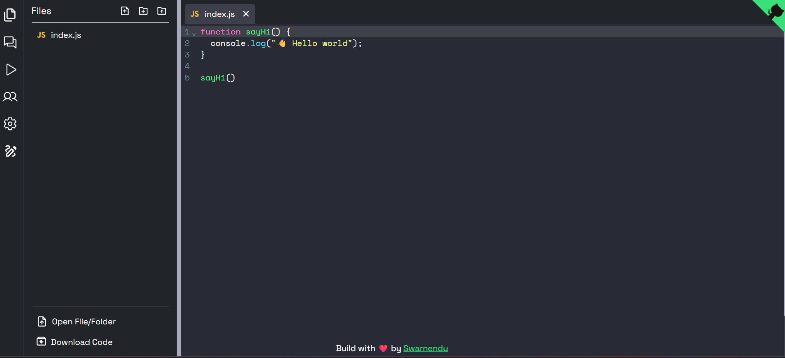

<Callout>
  Code Editor is a powerful collaborative coding platform that enables developers to code together in real-time. With features like live code execution, file uploads/downloads, and integrated chat, it provides a comprehensive environment for team coding sessions, interviews, and educational purposes.

</Callout>

---

### Dashboard UI

<div className="flex justify-center items-center border">
  
</div>

## Key Features

### Real-Time Collaboration

Multiple users can edit the same code simultaneously, with changes visible to everyone in real-time. Each collaboration session has a unique ID that can be shared with team members.

```typescript
// Server-side socket handling for real-time updates
io.on("connection", (socket) => {
  socket.on("join-room", (roomId) => {
    socket.join(roomId);
    socket.to(roomId).emit("user-joined", socket.id);
  });

  socket.on("code-change", ({ roomId, code }) => {
    socket.to(roomId).emit("receive-changes", code);
  });
});
```

### Live Code Execution

Execute code directly in the browser and see results immediately. Supported languages include JavaScript, Python, C++, Java, and more.

```typescript
// Code execution handler
const executeCode = async (code: string, language: string) => {
  try {
    const response = await api.post("/execute", {
      code,
      language,
    });

    return {
      output: response.data.output,
      executionTime: response.data.executionTime,
    };
  } catch (error) {
    return {
      error: "Execution failed",
      details: error.message,
    };
  }
};
```

### File Management

Upload code files from your local machine or download your work when done. Supports various file formats including .js, .py, .cpp, .java, and more.

### Integrated Chat System

Communicate with your collaborators in real-time through the built-in chat system without leaving the coding environment.

```typescript
// Chat system implementation
const ChatComponent = () => {
  const [messages, setMessages] = useState<Message[]>([]);
  const [newMessage, setNewMessage] = useState("");
  const roomId = useParams().roomId;

  useEffect(() => {
    socket.on("receive-message", (message: Message) => {
      setMessages((prev) => [...prev, message]);
    });

    return () => {
      socket.off("receive-message");
    };
  }, []);

  const sendMessage = () => {
    if (!newMessage.trim()) return;

    const message = {
      id: uuidv4(),
      sender: user.name,
      text: newMessage,
      timestamp: new Date().toISOString(),
    };

    socket.emit("send-message", { roomId, message });
    setMessages((prev) => [...prev, message]);
    setNewMessage("");
  };

  // Component render logic
};
```

### Drawing Capabilities

Integrated with tldraw, allowing users to create diagrams, flowcharts, and visual explanations alongside their code.

## Technical Architecture

Code Editor is built with a modern tech stack:

### Frontend

- React with TypeScript for type safety
- Redux for state management
- Socket.IO client for real-time communication
- CodeMirror for the code editor interface
- TailwindCSS for styling

### Backend

- Node.js with Express
- Socket.IO for WebSocket connections
- Docker for containerization and sandboxed code execution
- Redis for session management and caching

```
├── frontend/
│   ├── src/
│   │   ├── components/
│   │   │   ├── Editor/
│   │   │   ├── Chat/
│   │   │   ├── Drawing/
│   │   │   ├── FileManagement/
│   │   ├── redux/
│   │   ├── services/
│   │   │   ├── socket.ts
│   │   │   ├── api.ts
│   │   ├── pages/
│   ├── public/
├── backend/
│   ├── src/
│   │   ├── controllers/
│   │   ├── services/
│   │   │   ├── execution.service.ts
│   │   │   ├── room.service.ts
│   │   ├── routes/
│   ├── Dockerfile
```

## Implementation Challenges & Solutions

### Operational Transformation

To handle concurrent edits without conflicts, we implemented a basic operational transformation algorithm:

```typescript
// Simplified operational transformation logic
function transformOperation(operation, concurrentOperation) {
  // Handle insert/delete operations and resolve conflicts
  if (operation.type === "insert" && concurrentOperation.type === "insert") {
    if (operation.position <= concurrentOperation.position) {
      return operation;
    } else {
      return {
        ...operation,
        position: operation.position + concurrentOperation.text.length,
      };
    }
  }

  // Other transformation cases...
}
```

### Secure Code Execution

To execute user code securely, we implemented a containerized solution:

1. Each execution runs in an isolated Docker container
2. Resource limits prevent excessive CPU/memory usage
3. Timeouts prevent infinite loops
4. Network access is restricted to prevent malicious requests

## Performance Optimizations

1. **Debounced Updates**: Code changes are sent to other users after a short delay to prevent excessive network traffic.
2. **Efficient Diffing**: Only the changes between code versions are transmitted, not the entire codebase.
3. **Lazy Loading**: Components like the drawing tool and language-specific syntaxes are loaded only when needed.

## Future Plans

1. **More Language Support**: Adding support for more programming languages and frameworks
2. **Video Conferencing**: Integrated audio/video chat for better collaboration
3. **AI-Powered Code Completion**: Smart suggestions and auto-completion
4. **Version Control**: Built-in Git-like functionality to track code changes
5. **Collaborative Debugging**: Shared debugging tools and breakpoints

## Getting Started

Clone the repository and follow these steps:

```bash
# Clone the repository
git clone https://github.com/swarnendu19/code-editor.git

# Install dependencies for frontend and backend
cd code-editor/frontend
npm install
cd ../backend
npm install

# Start the development servers
# Terminal 1 (Frontend)
cd frontend
npm run dev

# Terminal 2 (Backend)
cd backend
npm run dev
```

Visit `http://localhost:3000` to start using the collaborative code editor!
