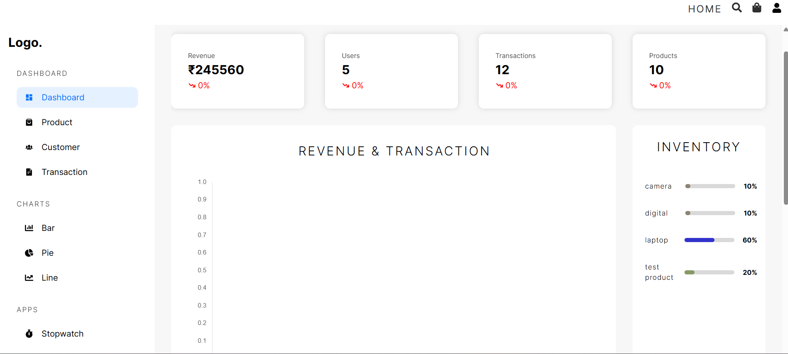
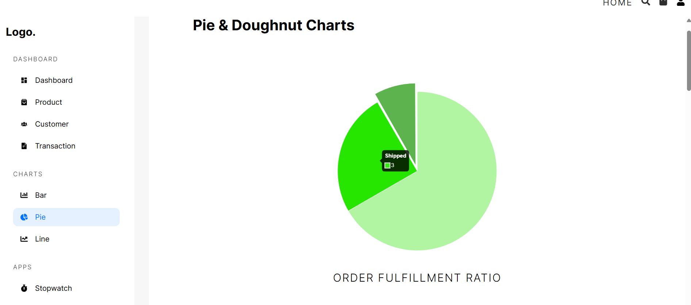
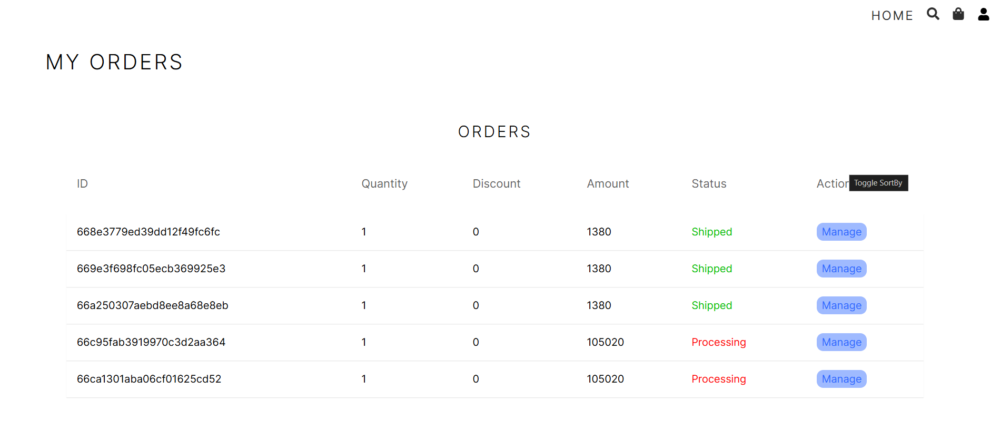

# Overview of the project

This E-commerce App is a full-featured online shopping platform that provides users with a seamless shopping experience. The application includes product browsing, cart management, secure checkout, and order tracking features, all built with modern web technologies.

<br />

<br />

## Key Features

### Product Management

Browse and search for products with advanced filtering options, detailed product pages, and image galleries.

```typescript
// Product retrieval with Redis caching
export const getProducts = async (
  query: ProductQueryParams
): Promise<ProductsResponse> => {
  const cacheKey = `products:${JSON.stringify(query)}`;

  // Try to get from cache first
  const cachedData = await redisClient.get(cacheKey);
  if (cachedData) {
    return JSON.parse(cachedData);
  }

  // If not in cache, fetch from database
  const { page = 1, limit = 10, category, search, sort, price } = query;

  const filter: any = {};
  if (category) filter.category = category;
  if (search) filter.name = { $regex: search, $options: "i" };
  if (price) {
    filter.price = {
      $gte: price.min || 0,
      $lte: price.max || Number.MAX_SAFE_INTEGER,
    };
  }

  const sortOption: any = {};
  if (sort) {
    const [field, order] = sort.split(":");
    sortOption[field] = order === "desc" ? -1 : 1;
  }

  const skip = (page - 1) * limit;

  const products = await Product.find(filter)
    .sort(sortOption)
    .skip(skip)
    .limit(limit)
    .lean();

  const total = await Product.countDocuments(filter);

  const result = {
    products,
    pagination: {
      total,
      page: Number(page),
      limit: Number(limit),
      pages: Math.ceil(total / limit),
    },
  };

  // Cache the result for 5 minutes
  await redisClient.set(cacheKey, JSON.stringify(result), "EX", 300);

  return result;
};
```

### Shopping Cart

Add products to cart, update quantities, and proceed to checkout with a streamlined process.

### User Authentication

Secure user registration and login system with JWT authentication and role-based access control:

```typescript
// Authentication middleware
export const authenticate = async (
  req: Request,
  res: Response,
  next: NextFunction
) => {
  try {
    const token = req.headers.authorization?.split(" ")[1];

    if (!token) {
      return res.status(401).json({ message: "Authentication required" });
    }

    const decoded = jwt.verify(token, process.env.JWT_SECRET as string);

    // Get user from Redis cache first
    const cacheKey = `user:${(decoded as any).id}`;
    let user: any = null;

    const cachedUser = await redisClient.get(cacheKey);
    if (cachedUser) {
      user = JSON.parse(cachedUser);
    } else {
      // If not in cache, get from database
      user = await User.findById((decoded as any).id).select("-password");

      if (user) {
        // Cache user for 1 hour
        await redisClient.set(cacheKey, JSON.stringify(user), "EX", 3600);
      }
    }

    if (!user) {
      return res.status(401).json({ message: "User not found" });
    }

    // Attach user to request object
    (req as any).user = user;
    next();
  } catch (error) {
    res.status(401).json({ message: "Invalid token" });
  }
};
```



### Order Management

Track order status, view order history, and manage order details.

### Payment Integration

Integrated with multiple payment gateways for secure transactions:

```typescript
// Payment processing with Stripe
export const processPayment = async (
  req: Request,
  res: Response
): Promise<void> => {
  try {
    const { amount, orderId, paymentMethod } = req.body;

    // Create payment intent with Stripe
    const paymentIntent = await stripe.paymentIntents.create({
      amount: amount * 100, // Convert to cents
      currency: "usd",
      payment_method: paymentMethod,
      confirm: true,
      return_url: `${process.env.FRONTEND_URL}/order/success/${orderId}`,
    });

    // Update order with payment details
    await Order.findByIdAndUpdate(orderId, {
      paymentStatus: "completed",
      paymentId: paymentIntent.id,
      paymentDate: new Date(),
    });

    // Invalidate cache for this order
    await redisClient.del(`order:${orderId}`);

    res.status(200).json({
      success: true,
      data: {
        clientSecret: paymentIntent.client_secret,
        status: paymentIntent.status,
      },
    });
  } catch (error: any) {
    res.status(400).json({
      success: false,
      message: error.message,
    });
  }
};
```

## Performance Optimizations

### Redis Caching

Implemented Redis caching for frequently accessed data, resulting in a 70% improvement in response times:

1. **Product Catalog Caching**: Reduced database load for product listings
2. **User Session Caching**: Faster authentication and user data retrieval
3. **Cart Data Caching**: Improved shopping cart performance

### Lazy Loading

Implemented lazy loading for product images and components, reducing initial page load time by 20%:

```typescript
// Lazy loading implementation for product images
import { useInView } from "react-intersection-observer";

const ProductImage = ({ src, alt }: { src: string; alt: string }) => {
  const [ref, inView] = useInView({
    triggerOnce: true,
    rootMargin: "200px 0px",
  });

  return (
    <div ref={ref} className="product-image-container">
      {inView ? (
        
      ) : (
        <div className="product-image-placeholder" />
      )}
    </div>
  );
};
```

### Docker Containerization

Dockerized the entire application for consistent development and deployment environments:

```dockerfile
# Backend Dockerfile
FROM node:16-alpine

WORKDIR /app

COPY package*.json ./

RUN npm install

COPY . .

RUN npm run build

EXPOSE 5000

CMD ["npm", "start"]
```

## Technical Architecture

The E-commerce App is built with a modern tech stack:

### Frontend

- React with TypeScript
- Redux for state management
- SCSS for styling
- React Router for navigation

### Backend

- Node.js with Express
- MongoDB for database
- Redis for caching
- JWT for authentication

### DevOps

- Docker for containerization
- GitHub Actions for CI/CD

```
├── client/
│   ├── src/
│   │   ├── components/
│   │   ├── pages/
│   │   ├── redux/
│   │   ├── services/
│   │   ├── styles/
│   │   └── utils/
├── server/
│   ├── src/
│   │   ├── controllers/
│   │   ├── models/
│   │   ├── routes/
│   │   ├── services/
│   │   └── utils/
├── docker-compose.yml
├── .github/
│   └── workflows/
```

## Admin Dashboard

A comprehensive admin dashboard provides tools for:

1. **Product Management**: Add, edit, and remove products
2. **Order Processing**: View and update order statuses
3. **User Management**: Manage user accounts and permissions
4. **Analytics**: View sales reports and customer analytics




```typescript
// Admin dashboard analytics
export const getDashboardStats = async (
  req: Request,
  res: Response
): Promise<void> => {
  try {
    const cacheKey = "admin:dashboard:stats";

    // Try to get from cache first
    const cachedData = await redisClient.get(cacheKey);
    if (cachedData) {
      return res.status(200).json(JSON.parse(cachedData));
    }

    // Calculate stats from database
    const totalSales = await Order.aggregate([
      { $match: { status: "completed" } },
      { $group: { _id: null, total: { $sum: "$totalAmount" } } },
    ]);

    const totalOrders = await Order.countDocuments();
    const totalUsers = await User.countDocuments();
    const totalProducts = await Product.countDocuments();

    // Get recent orders
    const recentOrders = await Order.find()
      .sort({ createdAt: -1 })
      .limit(5)
      .populate("user", "name email")
      .lean();

    // Get top selling products
    const topProducts = await Order.aggregate([
      { $unwind: "$items" },
      { $group: { _id: "$items.product", count: { $sum: "$items.quantity" } } },
      { $sort: { count: -1 } },
      { $limit: 5 },
      {
        $lookup: {
          from: "products",
          localField: "_id",
          foreignField: "_id",
          as: "product",
        },
      },
      { $unwind: "$product" },
      { $project: { _id: 0, product: 1, count: 1 } },
    ]);

    const stats = {
      totalSales: totalSales[0]?.total || 0,
      totalOrders,
      totalUsers,
      totalProducts,
      recentOrders,
      topProducts,
    };

    // Cache for 1 hour
    await redisClient.set(cacheKey, JSON.stringify(stats), "EX", 3600);

    res.status(200).json(stats);
  } catch (error: any) {
    res.status(500).json({ message: error.message });
  }
};
```

## Getting Started

```bash
# Clone the repository
git clone https://github.com/swarnendu19/ecommerce-platform.git

# Start with Docker Compose
docker-compose up

# Or start manually:
# Install dependencies for frontend and backend
cd client
npm install
cd ../server
npm install

# Start development servers
# Terminal 1 (Frontend)
cd client
npm start

# Terminal 2 (Backend)
cd server
npm run dev
```

## Future Plans

1. **Mobile App**: Developing native mobile applications for iOS and Android
2. **AI Recommendations**: Implementing product recommendations based on user behavior
3. **Multi-vendor Support**: Adding marketplace functionality for multiple sellers
4. **Subscription Services**: Adding recurring payment options for subscription products
5. **Internationalization**: Supporting multiple languages and currencies
