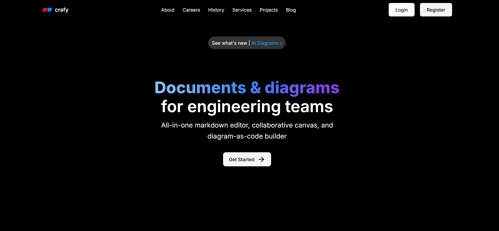
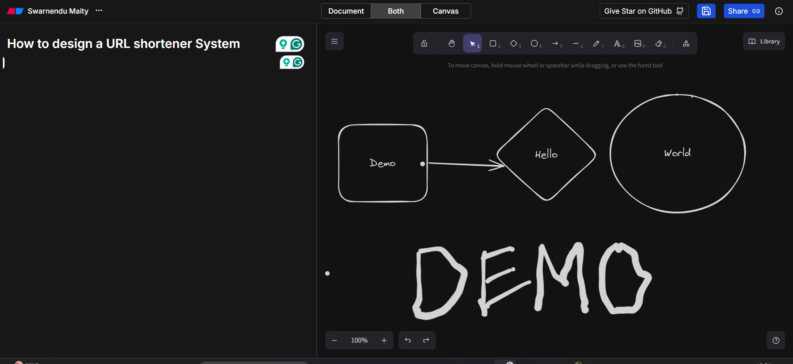

# Overview of the project

Eraser Clone is a comprehensive document and whiteboard platform inspired by the popular Eraser.io app. It provides a collaborative environment for creating, editing, and sharing documents and drawings with a clean, intuitive interface.

<br />


<br />

<div className="flex justify-center items-center">
  
</div>

## Key Features

### Document Editing

Create and edit rich documents with support for headings, lists, code blocks, embeds, and more. The document editor supports Markdown and provides a clean, distraction-free writing experience.

```typescript
// Document editor component structure
const DocumentEditor = ({ documentId }: { documentId: string }) => {
  const document = useDocument(documentId);
  const editor = useEditor({
    extensions: [
      StarterKit,
      CodeBlockLowlight,
      Image,
      Embed,
      TaskList,
      TaskItem,
      // Additional extensions
    ],
    content: document?.content || "",
    onUpdate: ({ editor }) => {
      // Save changes to the database
      updateDocument({
        id: documentId,
        content: editor.getJSON(),
      });
    },
  });

  return (
    <div className="document-editor">
      <EditorProvider editor={editor}>
        <EditorContent />
        <FloatingMenu editor={editor} />
        <BubbleMenu editor={editor} />
      </EditorProvider>
    </div>
  );
};
```

### Drawing Canvas

Create diagrams, flowcharts, and illustrations using the drawing canvas. The canvas provides a variety of tools including shapes, connectors, text, and freehand drawing.

### Authentication System

Integrated with Kinde authentication for secure user management:

```typescript
// Authentication hooks and components
export const useAuth = () => {
  const { user, isLoaded } = useKindeAuth();

  return {
    user,
    isLoaded,
    isAuthenticated: isLoaded && !!user,
  };
};

export const RequireAuth = ({ children }: { children: React.ReactNode }) => {
  const { isAuthenticated, isLoaded } = useAuth();
  const router = useRouter();

  useEffect(() => {
    if (isLoaded && !isAuthenticated) {
      router.push("/auth/login");
    }
  }, [isAuthenticated, isLoaded, router]);

  if (!isLoaded || !isAuthenticated) {
    return <LoadingScreen />;
  }

  return <>{children}</>;
};
```

### Real-time Collaboration

Multiple users can work on the same document or canvas simultaneously, with changes synced in real-time using Convex database:

```typescript
// Convex real-time sync setup
export const documentSchema = defineSchema({
  documents: defineTable({
    title: v.string(),
    content: v.any(),
    workspaceId: v.id("workspaces"),
    userId: v.string(),
    isPublic: v.boolean(),
    lastUpdated: v.number(),
    collaborators: v.array(v.string()),
  })
    .index("by_workspace", ["workspaceId"])
    .index("by_user", ["userId"]),

  // Other tables...
});

// Mutations for real-time updates
export const updateDocument = mutation({
  args: {
    id: v.id("documents"),
    content: v.any(),
    title: v.optional(v.string()),
  },
  handler: async (ctx, args) => {
    const identity = await ctx.auth.getUserIdentity();
    if (!identity) {
      throw new Error("Unauthorized");
    }

    const document = await ctx.db.get(args.id);
    if (!document) {
      throw new Error("Document not found");
    }

    // Check permissions...

    return await ctx.db.patch(args.id, {
      content: args.content,
      title: args.title ?? document.title,
      lastUpdated: Date.now(),
    });
  },
});
```

### Workspace Organization

Organize your documents and drawings in workspaces and folders, making it easy to manage and navigate through your content.

## Enhanced UI Features

I've added several UI enhancements that weren't in the original Eraser app:

### Module's Home Page Organization

The workspace homepage has been redesigned for better organization and navigation:

1. **Grid/List View Toggle**: Switch between different views of your documents
2. **Advanced Filtering**: Filter documents by type, date, and other attributes
3. **Custom Sorting Options**: Sort by recently modified, alphabetical, or custom order

### Dark/Light Mode Support

Fully implemented dark and light mode with smooth transitions:

```typescript
// Theme toggle component
export function ThemeToggle() {
  const { setTheme, theme } = useTheme();

  return (
    <Button
      variant="outline"
      size="icon"
      onClick={() => setTheme(theme === "light" ? "dark" : "light")}
    >
      <Sun className="h-[1.2rem] w-[1.2rem] rotate-0 scale-100 transition-all dark:-rotate-90 dark:scale-0" />
      <Moon className="absolute h-[1.2rem] w-[1.2rem] rotate-90 scale-0 transition-all dark:rotate-0 dark:scale-100" />
      <span className="sr-only">Toggle theme</span>
    </Button>
  );
}
```

### Collaborative Features

Enhanced collaboration with:

1. **User Presence**: See who's actively viewing or editing a document
2. **Change History**: Track changes and revert to previous versions
3. **Comments and Annotations**: Leave feedback directly on documents and drawings

## Technical Architecture

Eraser Clone is built with a modern tech stack:

- **Frontend**: Next.js 14 with React and TypeScript
- **UI Components**: ShadCN UI with Tailwind CSS
- **Database**: Convex for real-time data synchronization
- **Authentication**: Kinde Auth
- **Drawing Tools**: Custom implementation using Canvas API and React
- **Document Editor**: Custom implementation on top of Tiptap
- **Deployment**: Vercel

```
├── app/
│   ├── (auth)/
│   │   ├── login/
│   │   └── signup/
│   ├── (dashboard)/
│   │   ├── documents/
│   │   └── boards/
│   └── api/
├── components/
│   ├── auth/
│   ├── dashboard/
│   ├── document/
│   ├── board/
│   └── ui/
├── convex/
│   ├── schema.ts
│   ├── documents.ts
│   ├── boards.ts
│   └── users.ts
├── lib/
│   ├── hooks/
│   └── utils/
```

## Performance Optimizations

1. **Server Components**: Utilizing Next.js 14 server components for improved performance
2. **Incremental Rendering**: Loading only the necessary parts of documents
3. **Optimistic Updates**: Providing immediate feedback while syncing with the server
4. **Debounced Saving**: Reducing database writes by debouncing save operations

## Getting Started

```bash
# Clone the repository
git clone https://github.com/swarnendu19/eraser-clone.git

# Install dependencies
cd eraser-clone
npm install

# Set up environment variables
cp .env.example .env

# Start the development server
npm run dev
```

Visit `http://localhost:3000` to start using Eraser Clone.

## Future Plans

1. **Templates**: Add document and board templates for faster creation
2. **Presentation Mode**: Present documents and boards directly from the app
3. **Export Options**: Export to PDF, Image, and other formats
4. **AI Integration**: AI-powered features like content generation and auto-layouts
5. **Mobile Apps**: Native mobile applications for iOS and Android
